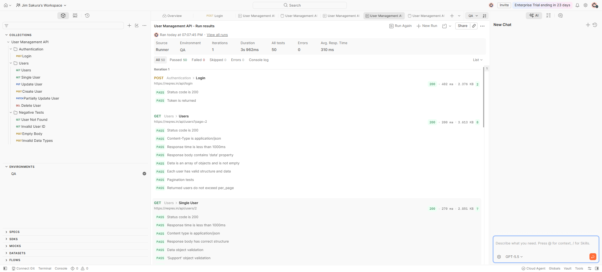
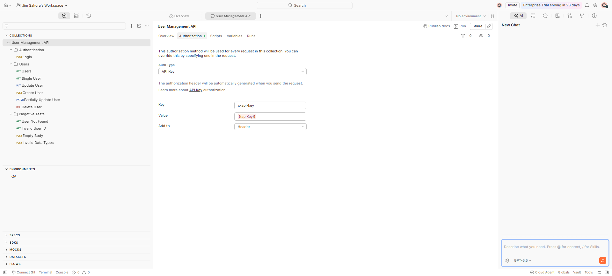
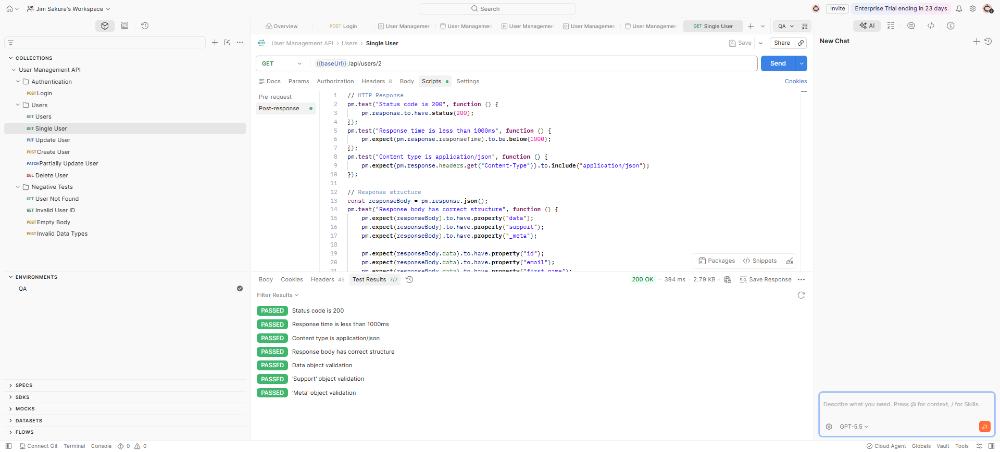

# User Management API Testing

## Project Overview

This project demonstrates API testing skills using Postman by testing the ReqRes User Management API.

The collection covers authentication, CRUD operations, response validation, data validation, and negative test scenarios. Each request contains automated JavaScript assertions to verify both functional and non-functional API behavior.

---

## Project Objectives

- Validate REST API endpoints
- Verify HTTP status codes
- Validate response payloads
- Verify response headers
- Check response time
- Perform positive and negative testing
- Practice API automation using Postman

---

## API Endpoints Tested

### Authentication
- Login

### User Management
- Get Users
- Get Single User
- Create User
- Update User (PUT)
- Partially Update User (PATCH)
- Delete User

### Negative Scenarios
- User Not Found
- Invalid User ID
- Empty Request Body
- Invalid Data Types

---

## Validation Performed

The collection includes automated validation for:

- HTTP Status Codes
- Response Time
- Content-Type
- JSON Response Structure
- Required Fields
- Data Types
- Email Format
- URL Format
- Pagination
- Timestamp Format
- Empty Response Validation

---

## Technologies

- Postman
- JavaScript
- REST API
- JSON

---

## Screenshots

### Collection Runner

### Collection Structure & Authorization

### Single User Test

---

## Notes

Some negative scenarios (such as invalid data types or empty request bodies) return **201 Created** because the ReqRes API is a public demo API and does not enforce strict server-side validation. These tests are included to demonstrate how such behavior can be identified and documented during API testing.

---

## Author

Ana
